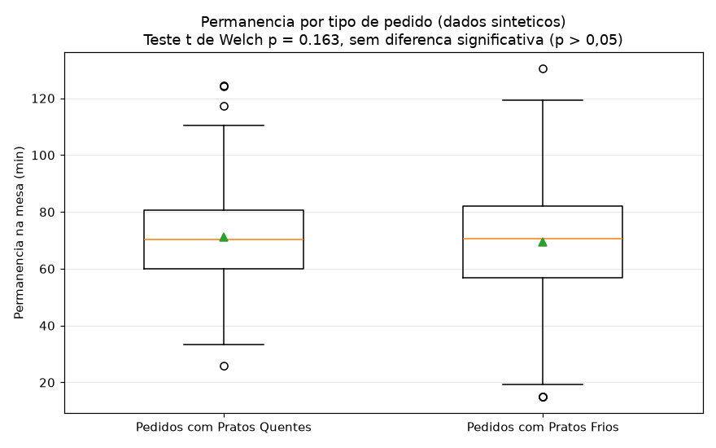

# Análise de Giro de Mesa - PDV

Este repositório contém os scripts de análise estatística desenvolvidos para mapear o tempo de permanência de clientes e a ociosidade física das mesas de um restaurante japonês. 

A análise foi feita com base nos dados do sistema de PDV (86 mil transações em 29 meses) para responder a dúvidas operacionais reais sobre o giro do salão e desempenho das mesas físicas.

## Perguntas de Negócio e Metodologia

A diretoria tinha suspeitas de que os pratos quentes (Yakisoba, Teppanyaki, etc.) atrasavam a saída dos clientes da mesa em comparação aos pratos frios (sushis), travando o giro do salão no horário de pico. Além disso, queríamos identificar se mesas específicas possuíam desempenho de vendas inferior devido a fatores físicos (iluminação ruim, layout de circulação ou vista desfavorável).

### Critérios de Limpeza
*   Foram removidos pedidos de Balcão e Delivery, mantendo apenas o consumo local (Mesa/Comanda).
*   Taxas de serviço e embalagens foram excluídas para focar no consumo real de produtos.
*   O tempo de permanência foi calculado pela diferença entre o horário de fechamento e de abertura do cupom no PDV.

## Resultados Obtidos

### 1. Pratos Quentes vs. Frios (Teste de Hipótese)
Dividimos os pedidos em dois grupos baseados na presença de pratos quentes e aplicamos o **Teste t de Welch** (para variâncias desiguais) e a correlação Ponto-Bissetorial.

O teste estatístico revelou um **p-valor superior a 0,05** ($p \ge 0,05$), refutando a hipótese da gerência. Não há diferença estatisticamente significativa no tempo de permanência de clientes que pedem pratos quentes comparado aos que consomem pratos frios. O tempo médio geral de ocupação ficou em 63 minutos.

### 2. Desempenho Físico das Mesas
O cruzamento de vendas por mesa física revelou que a ociosidade e o menor faturamento de algumas mesas não eram causados pelo tipo de prato servido, mas sim por barreiras de layout no salão (iluminação fraca e proximidade com áreas de barulho ou serviço).

Esta constatação direcionou a reforma de iluminação e reposicionamento do mobiliário físico do salão, garantindo que mesas antes evitadas pelos clientes voltassem a gerar vendas.

## Visualização dos Tempos
A distribuição dos tempos de permanência foi plotada para validar a sobreposição de comportamento entre as categorias quentes e frias:



## Como rodar o projeto

1. Instale as dependências:
   ```bash
   pip install -r requirements.txt
   ```
2. Execute o script de plotagem para visualizar a distribuição dos tempos com base em dados de simulação:
   ```bash
   python grafico_giro.py
   ```

Os scripts estatísticos principais encontram-se em `analise_giro_mesa.py`.
